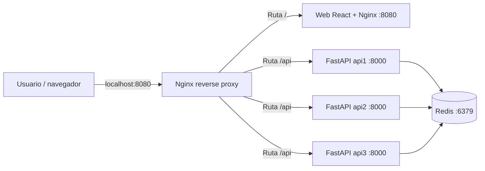
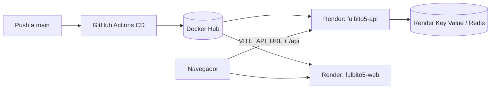

# Fulbito5 — Informe técnico y guion para el coloquio

**Trabajo Práctico 1 — DevOps — UTN FRRe — 2026**  
**Tema:** aplicación web, API y Redis contenerizados  
**Repositorio:** <https://github.com/yamilmoselli/tp1devops>  
**Integrantes:** completar antes de entregar  
**Fecha del coloquio:** 14 de septiembre de 2026

---

## 1. Resumen ejecutivo

Fulbito5 es una aplicación para armar dos equipos equilibrados de fútbol 5. El usuario carga exactamente diez jugadores y asigna a cada uno un valor de ataque y defensa entre 1 y 5. La API analiza las combinaciones posibles, selecciona la división con menor diferencia total y guarda el partido en Redis.

El proyecto fue diseñado como un sistema distribuido simple:

- Una interfaz web desarrollada con React y Vite.
- Una API REST desarrollada con FastAPI.
- Redis como almacén de datos en memoria.
- Tres réplicas locales de la API.
- Nginx como proxy reverso y balanceador de carga.
- Docker y Docker Compose para contenerización y orquestación local.
- GitHub Actions para pruebas, análisis de seguridad y publicación de imágenes.
- Docker Hub como registro de imágenes.
- Render como plataforma cloud.

La propuesta supera el ejemplo mínimo de una lista de tareas: incorpora un algoritmo de optimización, historial persistido en Redis, telemetría de réplicas, balanceo round-robin, tolerancia a fallos, CI, SAST y CD.

> **Estado real al 13/09/2026:** la corrección del frontend para Render está en la rama `fix/render-deploy`, commit `ae28433`. Para verla en producción todavía hay que integrarla a `main`, esperar la publicación de la nueva imagen y seleccionar **Deploy latest reference** en Render.

---

## 2. Relación con la consigna

| Requisito | Implementación en Fulbito5 | Estado |
|---|---|---:|
| App web contenerizada | React/Vite compilado y servido por Nginx no privilegiado | Cumplido |
| API contenerizada | FastAPI ejecutada con Uvicorn | Cumplido |
| Redis o DB | Redis 7 Alpine con volumen local | Cumplido |
| Web → API → Redis | La web consume endpoints REST; solamente la API accede a Redis | Cumplido |
| Docker Compose | Define Redis, tres API, web y proxy | Cumplido |
| Proxy reverso | Nginx enruta `/api` al upstream de API y `/` a la web | Cumplido |
| Tres nodos de API | `api1`, `api2` y `api3` | Cumplido localmente |
| Balanceo | Nginx distribuye requests entre las tres réplicas | Cumplido localmente |
| Tolerancia a fallos | Se detiene una réplica y las restantes continúan atendiendo | Demostrable localmente |
| Tests unitarios | Pytest valida endpoints y algoritmo de balanceo | Cumplido |
| SAST | Bandit y Trivy en GitHub Actions | Cumplido |
| Badges | Badges de CI y SAST en README | Cumplido |
| Publicación en registry | CD construye y publica API y web en Docker Hub | Cumplido al hacer push a `main` |
| Deploy cloud desde registry | Servicios basados en imágenes Docker Hub en Render | En corrección final |
| Informe y coloquio | Este documento incluye informe, demo y guion | Cumplido |

### Correspondencia con la rúbrica

| Criterio | Puntaje | Evidencia que conviene mostrar |
|---|---:|---|
| Apps funcionando | 30 | Web, creación de partido, historial y respuesta de API |
| Variables en Redis | 10 | `api:visitas`, `partido:<uuid>` y `partidos:indice` |
| GitHub Actions → Registry | 20 | Ejecución de `cd.yml` e imágenes/tags en Docker Hub |
| CI: tests y SAST | 10 | Workflows, badges, pruebas Pytest, Bandit y Trivy |
| Servicio externo | 20 | API y web en Render después del redeploy final |
| Coloquio personal | 10 | Explicar arquitectura, flujo, errores y decisiones |

---

## 3. Problema resuelto por la aplicación

En un partido amateur suele ser difícil dividir diez jugadores de manera equilibrada. Hacerlo manualmente depende de apreciaciones subjetivas y puede producir equipos con diferencias grandes.

Fulbito5 propone el siguiente flujo:

1. El usuario carga diez nombres.
2. Asigna ataque y defensa de 1 a 5.
3. La web envía los datos a la API.
4. La API valida la entrada.
5. El algoritmo evalúa las divisiones de cinco contra cinco.
6. Se selecciona la combinación que minimiza la diferencia de puntaje.
7. El resultado se guarda en Redis.
8. La web muestra los equipos y permite consultar el historial.

### Funcionalidades agregadas al mínimo pedido

- Generación automática de equipos equilibrados.
- Valores de prueba para acelerar una demostración.
- Avatares visuales para los jugadores.
- Historial de partidos.
- Consulta del detalle de un partido.
- Identificador UUID y fecha UTC por partido.
- Telemetría: hostname, IP interna, uptime, visitas y cantidad de partidos.
- Botón para realizar varias solicitudes y visualizar las réplicas atendiendo.

---

## 4. Arquitectura

### 4.1. Arquitectura local



Todos los servicios comparten la red privada `backend`. Desde el host solamente se publica el puerto `8080` del proxy. Las APIs no necesitan exponerse directamente porque Nginx las alcanza por el DNS interno de Docker Compose.

### 4.2. Arquitectura cloud



En la nube la web y la API tienen dominios distintos. Por eso el frontend debe construir la URL con `VITE_API_URL`. FastAPI incluye `CORSMiddleware` para permitir esta comunicación entre orígenes.

### 4.3. Diferencia importante entre local y cloud

En local hay un Nginx frontal que recibe todo:

- `/` se envía al contenedor web.
- `/api` se envía a las tres APIs.

En Render, el contenedor web y la API son servicios separados. El Nginx interno de la imagen web solamente sirve archivos estáticos; no conoce las réplicas `api1`, `api2` y `api3`. Por eso una petición relativa a `/api/partidos` enviada al dominio web termina siendo interpretada como la búsqueda de un archivo físico.

---

## 5. Componentes del sistema

### 5.1. Frontend

Tecnologías principales:

- React 18.
- Vite 5.
- `boring-avatars` para representación visual.
- Nginx Unprivileged para servir el bundle de producción.

Componentes:

- `App.jsx`: coordina el último partido seleccionado y la actualización del historial.
- `PlayerForm.jsx`: captura diez jugadores, valida nombres, envía el partido y muestra los equipos.
- `MatchExplorer.jsx`: lista partidos almacenados y consulta su detalle.
- `NodeBanner.jsx`: muestra telemetría y permite observar qué réplica responde.
- `api.js`: centraliza la construcción de URLs de la API.

La función central incorporada en `api.js` hace dos cosas:

1. Si existe `VITE_API_URL`, antepone esa dirección a cada endpoint.
2. Si no existe, mantiene rutas relativas para que funcione el proxy local.

Ejemplos conceptuales:

```text
Local:  apiUrl('/api/info')
        → /api/info

Render: apiUrl('/api/info')
        → https://fulbito5-api-latest.onrender.com/api/info
```

También elimina barras finales de la base para evitar direcciones como `https://api.example.com//api/info`.

### 5.2. API

La API utiliza:

- FastAPI como framework REST.
- Uvicorn como servidor ASGI.
- Pydantic para validación.
- `redis-py` para acceder a Redis.

Variables de entorno:

| Variable | Valor local | Propósito |
|---|---|---|
| `REPLICA_ID` | 1, 2 o 3 | Identificar qué nodo respondió |
| `REDIS_HOST` | `redis` | Host interno del almacén |
| `REDIS_PORT` | `6379` | Puerto de Redis |

La API es stateless respecto del contenedor: las tres réplicas comparten los datos guardados en Redis. Esto permite reemplazar o detener una réplica sin perder el historial.

### 5.3. Endpoints

| Método | Endpoint | Función |
|---|---|---|
| GET | `/api` | Devuelve la identidad de la réplica |
| GET | `/api/visitas` | Devuelve el contador compartido de requests |
| GET | `/api/health` | Respuesta básica de salud |
| GET | `/api/info` | Hostname, IP, uptime, visitas y partidos |
| POST | `/api/partidos` | Valida, balancea y guarda un partido |
| GET | `/api/partidos` | Lista partidos del más reciente al más antiguo |
| GET | `/api/partidos/{id}` | Recupera un partido particular |

Ejemplo de entrada:

```json
{
  "jugadores": [
    { "nombre": "Ana", "ataque": 5, "defensa": 3 },
    { "nombre": "Bruno", "ataque": 4, "defensa": 4 }
  ]
}
```

En una petición real el arreglo debe contener exactamente diez jugadores. Pydantic también comprueba que ataque y defensa estén entre 1 y 5.

Ejemplo abreviado de salida:

```json
{
  "id": "uuid-del-partido",
  "fecha": "2026-09-13T23:00:00+00:00",
  "equipo_a": [],
  "equipo_b": [],
  "delta": 0
}
```

### 5.4. Algoritmo de balanceo

Cada jugador tiene el puntaje:

```text
score = ataque + defensa
```

El algoritmo genera todas las combinaciones posibles de cinco jugadores tomadas de un conjunto de diez:

```text
C(10,5) = 252 combinaciones
```

Para cada combinación:

1. La combinación constituye el equipo A.
2. Los cinco jugadores restantes constituyen el equipo B.
3. Se suma el score de cada equipo.
4. Se calcula `delta = |puntajeA - puntajeB|`.
5. Se conserva la división con menor delta.

El espacio de búsqueda es pequeño y fijo, por lo que evaluar exhaustivamente las 252 combinaciones es simple, determinista y suficientemente rápido.

### 5.5. Redis

Redis almacena tres tipos de claves:

| Clave | Tipo | Contenido |
|---|---|---|
| `api:visitas` | String/contador | Cantidad acumulada de requests |
| `partido:<uuid>` | Hash | ID, fecha, equipos serializados y delta |
| `partidos:indice` | Set | IDs de todos los partidos |

Flujo de guardado:

1. La API genera un UUID.
2. Registra la fecha en UTC.
3. Serializa ambos equipos como JSON.
4. Guarda un hash `partido:<uuid>`.
5. Agrega el UUID al set `partidos:indice`.

El índice evita usar `KEYS *` para listar partidos. La API obtiene los IDs del set y luego recupera cada hash.

### 5.6. Proxy reverso y balanceo

Nginx declara el upstream:

```nginx
upstream backend {
    server api1:8000;
    server api2:8000;
    server api3:8000;
}
```

Al no indicar otro algoritmo, Nginx utiliza round-robin. Las solicitudes sucesivas se distribuyen entre `api1`, `api2` y `api3`.

El proxy también conserva información del cliente mediante:

- `Host`.
- `X-Real-IP`.
- `X-Forwarded-For`.

Se configuró un solo worker de Nginx para que la rotación sea fácil de observar durante una demostración corta. Con múltiples workers, cada proceso mantiene estado propio y una secuencia pequeña puede parecer menos uniforme.

---

## 6. Contenerización

### 6.1. Imagen de la API

La imagen parte de `python:3.11-slim`:

1. Define `/app` como directorio de trabajo.
2. Instala dependencias desde `requirements.txt`.
3. Copia el código.
4. Crea el usuario no privilegiado `appuser`.
5. Expone el puerto 8000.
6. Ejecuta Uvicorn escuchando en `0.0.0.0:8000`.

Ejecutar como usuario no root reduce el impacto de una eventual vulnerabilidad dentro del contenedor.

### 6.2. Imagen de la web

Utiliza un build multi-stage:

1. La etapa Node instala dependencias y ejecuta `vite build`.
2. La etapa final contiene únicamente Nginx y los archivos de `dist`.

Ventajas:

- Node y las herramientas de compilación no quedan en producción.
- La imagen final es menor.
- La superficie de ataque se reduce.
- Nginx sirve archivos estáticos eficientemente.

La imagen final usa `nginxinc/nginx-unprivileged` y escucha en 8080 porque un usuario sin privilegios no puede enlazar normalmente puertos menores a 1024.

### 6.3. Docker Compose

Servicios definidos:

- `redis`: Redis 7 Alpine y volumen `redis-data`.
- `api1`: construye la imagen local de FastAPI.
- `api2` y `api3`: reutilizan la misma imagen.
- `web`: construye la aplicación React.
- `nginx`: única entrada pública en `localhost:8080`.

`depends_on` expresa el orden de arranque básico. La persistencia se logra mediante un volumen con nombre, por lo que recrear el contenedor Redis no elimina automáticamente los datos.

---

## 7. CI, seguridad y CD

### 7.1. Integración continua

El workflow `ci.yml` se ejecuta en pushes a `main` y `develop`, y en pull requests hacia `main`.

Etapas:

1. Checkout del repositorio.
2. Configuración de Python 3.11.
3. Instalación de dependencias.
4. Ejecución de Pytest.
5. Análisis Bandit.
6. Escaneo de Dockerfiles y Compose con Trivy.

### 7.2. Pruebas

Las pruebas verifican:

- Que el endpoint principal identifique una réplica.
- Que el algoritmo produzca dos equipos de cinco.
- Que ningún jugador aparezca en ambos equipos.
- Que estén presentes los diez jugadores originales.
- Que el delta obtenido sea realmente el mínimo posible.
- Que se rechace una cantidad diferente de diez jugadores.

La prueba más valiosa compara el resultado contra una búsqueda exhaustiva independiente. No solamente comprueba el formato: comprueba la propiedad central del algoritmo.

### 7.3. SAST

Se usan dos herramientas:

- **Bandit:** busca patrones inseguros en Python.
- **Trivy:** analiza Dockerfiles y configuración de Docker Compose, con foco en severidades HIGH y CRITICAL.

El workflow `sast.yml` genera SARIF y lo sube a GitHub Code Scanning. Esto integra los hallazgos con la interfaz de seguridad del repositorio.

### 7.4. Publicación continua

`cd.yml` se ejecuta solamente al hacer push a `main`:

1. Inicia sesión en Docker Hub mediante secrets.
2. Configura Docker Buildx.
3. Construye y publica la API.
4. Construye la web con `VITE_API_URL`.
5. Publica cada imagen con dos tags:
   - `latest` para el último release.
   - El SHA del commit para trazabilidad e inmutabilidad.

Imágenes:

```text
yamilmoselli/fulbito5-api:latest
yamilmoselli/fulbito5-api:<commit-sha>
yamilmoselli/fulbito5-web:latest
yamilmoselli/fulbito5-web:<commit-sha>
```

Los secrets `DOCKERHUB_USERNAME` y `DOCKERHUB_TOKEN` evitan guardar credenciales en el repositorio.

### 7.5. CI versus CD

- **CI** responde: “¿el cambio es válido, pasa pruebas y no introduce hallazgos graves?”.
- **CD** responde: “¿podemos construir y publicar artefactos desplegables?”.

Separarlos permite entender con rapidez si un problema pertenece a calidad de código o publicación.

---

## 8. Despliegue en Render

### Servicios

- API: `https://fulbito5-api-latest.onrender.com`
- Web: `https://fulbito5-web-latest.onrender.com`
- Persistencia: Render Key Value o Redis compatible.

La API necesita `REDIS_HOST` y `REDIS_PORT`. El Redis y la API deberían estar en la misma región para utilizar la red privada.

### Proceso correcto de actualización

1. Trabajar en una rama.
2. Abrir y revisar el pull request.
3. Integrar a `main`.
4. Esperar que CI y SAST finalicen correctamente.
5. Esperar que CD publique ambas imágenes.
6. Entrar en cada servicio de Render.
7. Elegir **Manual Deploy → Deploy latest reference**.
8. Verificar API y web.
9. Recargar el navegador sin caché si conserva el bundle anterior.

Los servicios creados desde imágenes precompiladas no detectan automáticamente que el contenido de `latest` cambió. Publicar en Docker Hub y ejecutar una nueva instancia en Render son dos pasos distintos.

---

## 9. Dificultades y errores encontrados

Esta sección es especialmente importante para la categoría “Excelente”: demuestra comprensión del proceso, no solamente del resultado final.

### 9.1. Contenedores ejecutándose como root

**Síntoma:** Trivy reportó severidad HIGH en los Dockerfiles.

**Causa:** API y web se ejecutaban con el usuario root por defecto.

**Solución:**

- Se creó `appuser` para FastAPI.
- Se reemplazó Nginx estándar por `nginxinc/nginx-unprivileged`.
- La web pasó del puerto 80 al 8080.
- Se actualizó el proxy para conectarse a `web:8080`.

**Aprendizaje:** una mejora de seguridad puede exigir cambios coordinados en puertos, health checks y comunicación entre servicios.

### 9.2. Problemas de configuración de Trivy

**Síntoma:** el workflow no interpretaba correctamente la configuración o la versión utilizada presentaba problemas.

**Solución:** se corrigió el formato de `trivy-action` y se fijó una revisión concreta mediante SHA.

**Aprendizaje:** fijar una acción por SHA mejora reproducibilidad y reduce el riesgo de cambios inesperados en dependencias externas.

### 9.3. Responsabilidades duplicadas entre CI y CD

**Síntoma:** la publicación a Docker Hub había quedado mezclada o duplicada en el workflow de CI.

**Solución:** se separó la publicación en `cd.yml` y se dejó la validación en `ci.yml`.

**Aprendizaje:** CI y CD están relacionados, pero tienen responsabilidades diferentes. Separarlos hace el pipeline más claro y diagnosticable.

### 9.4. Nginx sin privilegios y cambio de puerto

**Síntoma:** Nginx no podía escuchar en el puerto 80 al ejecutarse como usuario no root.

**Causa:** los puertos privilegiados requieren permisos adicionales.

**Solución:** la web escucha en 8080 y el Nginx frontal de Compose hace proxy a `web:8080`.

**Aprendizaje:** `EXPOSE`, el puerto real del proceso y el destino de `proxy_pass` deben mantenerse alineados.

### 9.5. Error 404 del frontend en Render

Log observado:

```text
open() "/usr/share/nginx/html/api/partidos" failed (2: No such file or directory)
GET /api/partidos HTTP/1.1 404
```

**Qué significa:** Nginx intentó abrir `/api/partidos` como un archivo estático dentro de la imagen web.

**Causa:** los componentes React usaban llamadas relativas hardcodeadas:

```js
fetch("/api/partidos")
```

Esto funciona localmente porque el proxy frontal intercepta `/api`. En Render, el navegador envía esa ruta al dominio del servicio web, donde no existe dicho proxy.

**Corrección implementada:** se creó un helper central que utiliza `import.meta.env.VITE_API_URL`. Los componentes ya no deciden individualmente dónde está la API.

**Estado:** commit `ae28433` en `fix/render-deploy`. La corrección no llega a producción hasta mergear a `main`, reconstruir la imagen y redesplegarla.

**Aprendizaje:** las variables `VITE_*` se incorporan durante la compilación, no al iniciar Nginx. Cambiar una variable del contenedor ya construido no modifica el JavaScript existente.

### 9.6. Imagen actualizada pero servicio viejo

**Síntoma:** el código parece corregido, pero Render sigue realizando las mismas requests.

**Causa:** un servicio de Render basado en una imagen no se redespliega solo cuando cambia `latest`.

**Solución:** después de finalizar CD, ejecutar **Deploy latest reference** o configurar un deploy hook.

**Aprendizaje:** registry y runtime son etapas diferentes. El registry almacena el artefacto; Render debe volver a descargarlo y reiniciar el servicio.

### 9.7. Riesgo pendiente: health check de la API

Actualmente existe una inconsistencia que conviene corregir antes de presentar:

- FastAPI expone `/api/health`.
- El Dockerfile y el README consultan `/health`.

Esto puede marcar la imagen como unhealthy aunque Uvicorn esté funcionando. Las opciones correctas son agregar `/health` como alias conservando `/api/health`, o cambiar el Dockerfile y Render para consultar `/api/health`. Lo importante es que los tres lugares coincidan.

### 9.8. Pruebas fuera de Docker y Redis ausente

Al ejecutar pruebas de endpoints fuera de Compose, el middleware intenta conectarse al hostname `redis`. Ese nombre existe en la red Docker, pero no necesariamente en el host. La API captura algunos errores de Redis, aunque el intento puede demorar según la resolución DNS y los timeouts.

**Aprendizaje:** una prueba unitaria debería aislar Redis mediante mocks o fixtures; una prueba de integración debería levantar explícitamente Redis.

---

## 10. Resultados obtenidos

- Aplicación web con una funcionalidad concreta y demostrable.
- API REST validada mediante modelos Pydantic.
- Algoritmo exhaustivo que encuentra el mínimo delta.
- Persistencia compartida en Redis.
- Tres réplicas stateless de la API.
- Balanceo round-robin con Nginx.
- Continuidad ante la caída de una réplica durante consultas.
- Contenedores ejecutados sin privilegios de root.
- Pruebas automatizadas con Pytest.
- Análisis estático con Bandit y Trivy.
- Badges visibles en el repositorio.
- Publicación automática de imágenes a Docker Hub.
- Trazabilidad mediante tags por SHA.
- Servicios creados en Render desde imágenes del registry.
- Diagnóstico y corrección del problema de rutas entre dominios.

---

## 11. Posibles mejoras futuras

### Prioridad alta

- Alinear `/health` y `/api/health`.
- Agregar tests del helper de URL y de los componentes React.
- Mockear Redis en tests unitarios para evitar dependencias y demoras.
- Configurar un deploy hook para que Render se actualice después de CD.
- Utilizar `REDIS_URL` para soportar credenciales y TLS con una sola variable.

### Seguridad y calidad

- Restringir CORS al dominio real del frontend en producción.
- Fijar por SHA todas las GitHub Actions, no solamente Trivy.
- Agregar lockfiles de dependencias para builds reproducibles.
- Separar dependencias productivas de dependencias de testing.
- Incorporar escaneo de vulnerabilidades de las imágenes publicadas.

### Operación

- Agregar timeouts explícitos al cliente Redis.
- Implementar retries controlados y respuestas claras cuando Redis no esté disponible.
- Crear un health check de readiness que verifique Redis.
- Incorporar métricas y logs estructurados.
- Automatizar la infraestructura con `render.yaml`.
- Evitar depender solamente de `latest`; desplegar tags SHA o digests.

### Producto

- Autenticación y grupos de usuarios.
- Edición o eliminación de partidos.
- Más atributos por jugador.
- Restricciones para evitar repetir siempre las mismas parejas.
- Estadísticas históricas y comparación de resultados.

---

## 12. Guion de demostración técnica

### Preparación previa

- [ ] Completar nombres de integrantes.
- [ ] Integrar `fix/render-deploy` a `main`.
- [ ] Confirmar CI, SAST y CD en verde.
- [ ] Redesplegar API y web en Render.
- [ ] Corregir o configurar el health check.
- [ ] Probar el flujo completo en una ventana privada.
- [ ] Tener Docker Desktop iniciado para la demo local.
- [ ] Tener abiertas las pestañas de GitHub Actions, Docker Hub y Render.
- [ ] Guardar capturas por si falla Internet.

### Levantar el entorno local

```powershell
docker compose up --build -d
docker compose ps
```

Abrir:

```text
http://localhost:8080/
```

### Demostrar la funcionalidad

1. Presionar **Cargar valores de prueba**.
2. Mostrar que existen diez jugadores con ataque y defensa.
3. Presionar **Balancear y Guardar**.
4. Explicar los dos equipos y el delta.
5. Señalar que el partido aparece en el explorador.
6. Seleccionar el partido para recuperar su detalle desde Redis.

### Demostrar balanceo

En PowerShell:

```powershell
1..9 | ForEach-Object { Invoke-RestMethod http://localhost:8080/api }
```

Resultado esperado: aparecen alternativamente las réplicas 1, 2 y 3.

También se puede usar el botón **Ping al Clúster** y observar los hostnames.

### Demostrar Redis

```powershell
docker compose exec redis redis-cli GET api:visitas
docker compose exec redis redis-cli SMEMBERS partidos:indice
docker compose exec redis redis-cli KEYS "partido:*"
```

Después de copiar un ID real:

```powershell
docker compose exec redis redis-cli HGETALL "partido:<ID>"
```

Explicar que `KEYS` se usa solamente para la demostración; la aplicación lista mediante el set `partidos:indice`.

### Demostrar tolerancia a fallos

Primero obtener los nombres:

```powershell
docker compose ps
```

Detener una réplica:

```powershell
docker compose stop api2
```

Volver a consultar:

```powershell
1..6 | ForEach-Object { Invoke-RestMethod http://localhost:8080/api }
```

La aplicación debe seguir respondiendo con las réplicas restantes.

Restaurar:

```powershell
docker compose start api2
```

### Mostrar CI/CD

1. Abrir la pestaña **Actions**.
2. Mostrar `CI Pipeline`, `SAST` y `CD Pipeline`.
3. Abrir una ejecución y explicar sus pasos.
4. Mostrar los tags `latest` y SHA en Docker Hub.
5. Mostrar que Render consume esas imágenes y no construye el repositorio.

### Mostrar cloud

1. Abrir la API y probar su endpoint de salud configurado.
2. Abrir la web.
3. Crear un partido.
4. En DevTools → Network, señalar que `/api/partidos` va al dominio API.
5. Refrescar y demostrar que el historial continúa en Redis.

---

## 13. Guion oral sugerido

### Apertura — 30 segundos

> “Nuestro proyecto se llama Fulbito5. En lugar de implementar una ToDo List, elegimos un problema real: dividir diez jugadores en dos equipos equilibrados según ataque y defensa. La solución está formada por una web React, una API FastAPI, Redis, tres réplicas locales y Nginx como proxy y balanceador. Todo está contenerizado y tiene pipelines de CI, seguridad y publicación.”

### Funcionalidad — 45 segundos

> “El usuario carga diez jugadores, asigna valores entre uno y cinco y solicita el balanceo. La API valida los datos con Pydantic y evalúa las 252 combinaciones posibles de cinco jugadores. Para cada una calcula la diferencia total y conserva la de menor delta. El partido recibe un UUID, una fecha UTC y se guarda en Redis. La web después recupera el historial y el detalle.”

### Arquitectura — 60 segundos

> “En local, Docker Compose levanta Redis, una web, tres réplicas idénticas de la API y un Nginx frontal. El usuario solamente entra por el puerto 8080. Nginx envía la raíz a la web y distribuye las rutas `/api` mediante round-robin entre las tres réplicas. Las réplicas son stateless y comparten Redis, por eso cualquiera puede atender una petición y detener una no elimina datos.”

### Redis — 40 segundos

> “Redis guarda el contador `api:visitas`, un hash por partido y un set con todos los IDs. El set funciona como índice y evita escanear todas las claves para listar. La web nunca accede directamente a Redis: solamente lo hace la API, como pide la consigna.”

### Contenedores y seguridad — 45 segundos

> “La API usa Python slim y la web un build multi-stage. React se compila con Node, pero producción contiene solamente Nginx y los archivos estáticos. Trivy nos indicó que los contenedores corrían como root. Lo corregimos usando usuarios sin privilegios. Eso obligó a cambiar la web al puerto 8080 y actualizar el proxy. Fue un ejemplo concreto de cómo una corrección de seguridad impacta la arquitectura.”

### CI/CD — 60 segundos

> “En cada cambio relevante, CI instala dependencias, ejecuta Pytest, Bandit y Trivy. SAST también publica resultados SARIF en GitHub Code Scanning. Cuando un cambio llega a main, CD construye las imágenes y las publica en Docker Hub con `latest` y con el SHA del commit. El SHA permite saber exactamente qué código contiene una imagen. Render despliega esas imágenes desde el registry, cumpliendo el requisito de no depender de una compilación manual.”

### Problema de Render — 60 segundos

> “El error más reciente ocurrió porque local y cloud no tienen exactamente el mismo enrutamiento. Los componentes usaban `/api/partidos`, que localmente funciona porque Nginx lo intercepta. En Render, esa ruta llegó al contenedor web, y Nginx intentó encontrar un archivo llamado `/usr/share/nginx/html/api/partidos`, devolviendo 404. Centralizamos las URLs y usamos `VITE_API_URL` durante el build. Además aprendimos que actualizar `latest` en Docker Hub no actualiza automáticamente un servicio basado en imágenes: Render debe redesplegar la referencia.”

### Cierre — 30 segundos

> “El proyecto cumple la integración web, API y Redis, agrega balanceo y tolerancia a fallos, automatiza pruebas, seguridad y publicación, y registra las dificultades reales del proceso. Como mejoras proponemos automatizar el deploy de Render, fortalecer health checks, mockear Redis en tests y desplegar por SHA en lugar de depender solamente de latest.”

---

## 14. Preguntas probables y respuestas

### ¿Por qué Redis y no una base relacional?

Redis es suficiente para este dominio, permite lectura y escritura rápida y sirve para demostrar un almacén compartido entre réplicas. Los partidos se modelan con hashes y un set índice.

### ¿La web accede directamente a Redis?

No. El navegador solamente habla con la API. La API es el único servicio con configuración y acceso a Redis.

### ¿Cómo saben que el balanceo es óptimo?

Con diez jugadores hay 252 combinaciones posibles de cinco. Se evalúan todas y se conserva el delta mínimo. Una prueba automatizada compara el resultado con una búsqueda exhaustiva independiente.

### ¿Por qué tres réplicas usan la misma imagen?

Porque el código es idéntico y stateless. Solamente cambia `REPLICA_ID`. Los datos compartidos viven en Redis.

### ¿Qué algoritmo usa Nginx?

Round-robin por defecto. Distribuye solicitudes sucesivas entre los servidores declarados en el upstream.

### ¿Qué pasa si cae una API?

Nginx puede continuar enviando consultas a las réplicas restantes. Como los datos están en Redis, no se pierde el historial al detener un contenedor de API.

### ¿Qué pasa si cae Redis?

La funcionalidad que necesita guardar o consultar partidos falla. Algunos accesos, como el contador, capturan errores, pero una mejora pendiente es manejar de forma uniforme la indisponibilidad y exponer readiness.

### ¿Qué diferencia hay entre imagen y contenedor?

La imagen es el artefacto inmutable con código y dependencias. Un contenedor es una instancia en ejecución de esa imagen.

### ¿Qué diferencia hay entre `latest` y el SHA?

`latest` es una etiqueta móvil. El SHA identifica una versión concreta y permite reproducir o revertir un despliegue con mayor seguridad.

### ¿Por qué la variable se llama `VITE_API_URL`?

Vite solamente expone al código frontend variables con prefijo `VITE_`. Además, se sustituyen durante `vite build`, porque el resultado final es JavaScript estático.

### ¿Por qué apareció el 404 en el Nginx web?

Porque el navegador envió `/api/...` al dominio de la web. Sin un proxy configurado allí, Nginx buscó esa ruta como archivo dentro de su directorio HTML.

### ¿Por qué CORS no era el error original?

La solicitud nunca llegó al dominio de la API: terminó con 404 en el servidor web. CORS empieza a ser relevante cuando el navegador sí intenta comunicarse entre ambos dominios. FastAPI ya tiene middleware CORS.

### ¿Qué aportan Bandit y Trivy?

Bandit analiza patrones inseguros en Python. Trivy analiza configuración e imágenes/contenedores según el modo utilizado. Son complementarios.

### ¿Por qué ejecutar sin root?

Limita privilegios dentro del contenedor. Si una aplicación es comprometida, el atacante dispone de menos capacidades.

### ¿El balanceo cloud también tiene tres réplicas?

No es necesario para cumplir la consigna. La arquitectura completa con tres réplicas y proxy se demuestra localmente; en cloud se exige al menos una instancia funcional desde el registry.

### ¿Por qué separar CI y CD?

CI valida el cambio. CD construye y distribuye el artefacto. Separarlos mejora claridad, permisos y diagnóstico.

### ¿Qué mejorarían primero?

Alinear health checks, automatizar el redeploy de Render con un hook, agregar mocks de Redis y usar tags SHA para despliegues reproducibles.

---

## 15. Plan de contingencia para el coloquio

Si falla Internet:

- Demostrar todo el flujo con Docker Compose.
- Mostrar capturas previas de Actions, Docker Hub y Render.
- Explicar que el requisito cloud fue desplegado desde registry.

Si Render está “dormido” o demora:

- Abrir primero la API para activarla.
- Esperar la respuesta antes de usar la web.
- Explicar que los planes gratuitos pueden tener cold start.

Si la web muestra el 404 antiguo:

1. Confirmar que `ae28433` llegó a `main`.
2. Confirmar que CD terminó correctamente.
3. Confirmar en Docker Hub la hora o SHA de la nueva imagen.
4. Ejecutar **Deploy latest reference** en Render.
5. Recargar con `Ctrl+F5` o usar una ventana privada.

Si Redis está vacío:

- Crear un partido durante la demo.
- Mostrar inmediatamente las claves con `redis-cli`.
- Explicar que el plan gratuito cloud puede no ofrecer persistencia durable.

Si una demostración de tolerancia falla:

- Revisar `docker compose ps`.
- Confirmar que al menos dos APIs estén ejecutándose.
- Usar GET `/api`, que es una operación segura para repetir.
- Restaurar la réplica detenida antes de continuar.

---

## 16. Checklist final de diez minutos

- [ ] Nombres de integrantes completos.
- [ ] Rama de corrección mergeada en `main`.
- [ ] Badges verdes.
- [ ] CD verde.
- [ ] Tags nuevos visibles en Docker Hub.
- [ ] Render redesplegado desde la referencia más reciente.
- [ ] Endpoint de health coherente y respondiendo.
- [ ] Web cloud crea y lista partidos.
- [ ] Docker Compose local probado.
- [ ] Comandos de demo copiados en un bloc de notas.
- [ ] Capturas de respaldo guardadas.
- [ ] Cada integrante sabe explicar al menos arquitectura, Redis, CI/CD y un error.

---

## 17. Conclusión

Fulbito5 demuestra el recorrido completo de una aplicación moderna pequeña: diseño funcional, API, almacenamiento compartido, contenerización, escalado horizontal local, proxy reverso, automatización de calidad, análisis de seguridad, publicación de artefactos y despliegue cloud.

El valor principal del trabajo no está solamente en que la aplicación funcione. También está en las decisiones y correcciones realizadas: separar CI de CD, ejecutar contenedores sin root, adaptar puertos, entender la diferencia entre proxy local y servicios cloud separados, utilizar variables de build y distinguir entre publicar una imagen y redesplegarla.

Esos problemas forman parte del resultado: muestran que el grupo pudo diagnosticar fallos a partir de logs, relacionarlos con la arquitectura y aplicar soluciones concretas.
