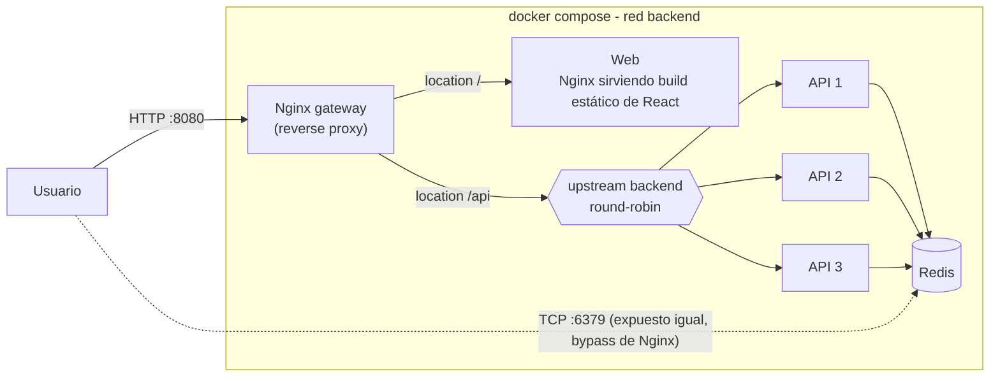
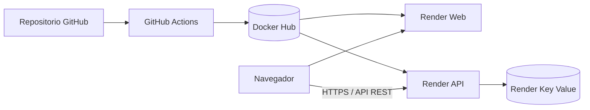

# Universidad Tecnológica Nacional

## Facultad Regional Resistencia

### DevOps — Trabajo Práctico N.º 1

# Fulbito5: aplicación web, API y Redis contenerizados

**Ciclo lectivo:** 2026  
**Docente:** José A. Fernández  

**Integrantes:**

- Moselli, Yamil Apas
- Ramírez, Eduardo Manuel
- Stegmayer, Tobias Sebastián

**Repositorio:** <https://github.com/yamilmoselli/tp1devops>  
**Fecha de entrega:** 14 de septiembre de 2026

---

## Índice

1. Introducción
2. Objetivos
3. Alcance funcional
4. Arquitectura de la solución
5. Tecnologías utilizadas
6. Réplicas de la API
7. Contenerización y orquestación
8. Proxy reverso, balanceo y tolerancia a fallos
9. Integración continua y seguridad
10. Publicación de imágenes y despliegue cloud
11. Dificultades encontradas y soluciones aplicadas
12. Mejoras futuras

---

## 1. Introducción

El presente trabajo documenta el diseño, desarrollo, contenerización y despliegue de **Fulbito5**, una aplicación destinada a formar equipos equilibrados para partidos de fútbol 5.

La solución permite cargar diez jugadores, asignar a cada uno valores de ataque y defensa, calcular una división equilibrada en dos equipos de cinco integrantes y almacenar el resultado en Redis. Los partidos generados pueden ser consultados posteriormente desde la interfaz web.

El proyecto fue desarrollado con el propósito de aplicar de manera integrada los conceptos solicitados por la cátedra:

- Separación entre aplicación web, API y almacenamiento.
- Contenerización de servicios.
- Orquestación mediante Docker Compose.
- Uso de Redis como almacenamiento compartido.
- Implementación de un proxy reverso.
- Ejecución de múltiples réplicas de la API.
- Balanceo de carga y tolerancia a la caída de una instancia.
- Integración continua con pruebas automatizadas.
- Análisis estático de seguridad.
- Construcción y publicación automática de imágenes.
- Despliegue cloud desde un registro de contenedores.

---

## 2. Objetivos

### 2.1. Objetivo general

Diseñar e implementar una aplicación distribuida, contenerizada y desplegable que integre una interfaz web, una API REST y Redis, incorporando prácticas de integración continua, seguridad, publicación de artefactos y despliegue cloud.

### 2.2. Objetivos específicos

- Desarrollar una interfaz web para la carga y visualización de jugadores y partidos.
- Implementar una API REST como único punto de acceso a Redis.
- Validar los datos recibidos antes de procesarlos.
- Crear un algoritmo que minimice la diferencia entre dos equipos.
- Almacenar partidos y métricas en Redis.
- Ejecutar tres réplicas locales de la API a partir de una misma imagen.
- Distribuir solicitudes mediante Nginx.
- Verificar la continuidad del servicio ante la caída de una réplica.
- Automatizar pruebas unitarias y análisis de seguridad.
- Construir y publicar imágenes en Docker Hub mediante GitHub Actions.
- Desplegar la aplicación en Render utilizando las imágenes publicadas.

---

## 3. Alcance funcional

Fulbito5 implementa las siguientes funcionalidades:

- Carga de diez jugadores.
- Asignación de valores de ataque y defensa entre 1 y 5.
- Generación de datos de prueba desde la interfaz.
- Validación de nombres y cantidad de jugadores.
- Cálculo automático de dos equipos equilibrados.
- Visualización del resultado y del delta entre equipos.
- Persistencia de cada partido en Redis.
- Consulta del historial de partidos.
- Consulta del detalle de un partido seleccionado.
- Visualización de información de la réplica que atendió la solicitud.
- Registro del número acumulado de solicitudes.
- Visualización de hostname, dirección interna, uptime y cantidad de partidos.

---

## 4. Arquitectura de la solución

### 4.1. Arquitectura local



La arquitectura local está compuesta por seis contenedores:

1. Un contenedor Redis.
2. Tres contenedores de la API.
3. Un contenedor para la aplicación web.
4. Un contenedor Nginx que funciona como entrada al sistema.

Todos los servicios se conectan a la red privada `backend`. El único puerto publicado para el acceso del usuario es el 8080 del proxy reverso.

Nginx aplica las siguientes reglas:

- Las solicitudes con prefijo `/api` se distribuyen entre las tres réplicas de la API.
- Las solicitudes restantes se envían al servicio web.

Las réplicas comparten el mismo Redis. Por esta razón, la información no depende de la instancia particular que atiende cada solicitud.

### 4.2. Arquitectura cloud



En el entorno cloud se utilizan servicios independientes para la web, la API y Redis. La comunicación del navegador con la API utiliza su URL pública, incorporada al frontend mediante la variable de compilación `VITE_API_URL`.

La consigna establece como obligatoria la arquitectura completa con proxy y réplicas en local, mientras que para el entorno cloud exige al menos una instancia funcional publicada desde un registro. Por ese motivo, Render ejecuta una sola instancia de cada aplicación.

---

## 5. Tecnologías utilizadas

| Área | Tecnología | Función |
|---|---|---|
| Frontend | React 18 | Construcción de la interfaz |
| Frontend | Vite 5 | Desarrollo y compilación del frontend |
| Frontend | Nginx Unprivileged | Servidor de archivos estáticos |
| Backend | Python 3.11 | Lenguaje de la API |
| Backend | FastAPI | Framework de API REST |
| Backend | Uvicorn | Servidor ASGI |
| Validación | Pydantic | Validación de modelos de entrada |
| Persistencia | Redis 7 | Almacenamiento en memoria |
| Proxy | Nginx | Enrutamiento y balanceo de carga |
| Contenedores | Docker | Construcción y ejecución de imágenes |
| Orquestación | Docker Compose | Definición del entorno local |
| Pruebas | Pytest | Pruebas automatizadas |
| Seguridad | Bandit | SAST para código Python |
| Seguridad | Trivy | Análisis de configuración y contenedores |
| Automatización | GitHub Actions | CI, SAST y CD |
| Registro | Docker Hub | Almacenamiento de imágenes |
| Cloud | Render | Ejecución de los servicios publicados |

---

## 6. Réplicas de la API

El código ejecutado por `api1`, `api2` y `api3` es idéntico. La diferencia se establece mediante `REPLICA_ID`.

Ninguna réplica mantiene el historial en memoria propia. Los datos compartidos se almacenan en Redis, lo que permite:

- Distribuir solicitudes entre instancias.
- Reemplazar una réplica sin migrar datos.
- Detener una instancia y continuar utilizando las restantes.

---

## 7. Contenerización y orquestación

### 7.1. Imagen de la API

La imagen utiliza `python:3.11-slim` y realiza los siguientes pasos:

1. Define `/app` como directorio de trabajo.
2. Copia e instala las dependencias.
3. Copia el código fuente.
4. Crea un usuario no privilegiado.
5. Expone el puerto 8000.
6. Ejecuta Uvicorn en `0.0.0.0:8000`.

### 7.2. Imagen del frontend

Se utiliza una construcción multi-stage:

1. Una etapa basada en Node 20 instala dependencias y compila React.
2. Una etapa final basada en Nginx Unprivileged recibe únicamente los archivos estáticos.

La web escucha en el puerto 8080.

### 7.3. Docker Compose

El archivo `docker-compose.yml` define:

- Red privada `backend`.
- Volumen `redis-data`.
- Redis basado en `redis:7-alpine`.
- Tres instancias de FastAPI.
- Servicio web.
- Proxy Nginx.

`api1` construye la imagen `fastapi-replica:1.0.0`, mientras que `api2` y `api3` reutilizan el mismo artefacto. De este modo se demuestra que las réplicas no requieren imágenes diferentes.

---

## 8. Proxy reverso, balanceo y tolerancia a fallos

Nginx define las tres APIs dentro de un upstream:

```nginx
upstream backend {
    server api1:8000;
    server api2:8000;
    server api3:8000;
}
```

Sin una directiva adicional, Nginx utiliza round-robin. Las solicitudes se distribuyen sucesivamente entre los nodos disponibles.

La configuración separa dos ubicaciones:

```text
/api  → upstream backend
/     → web:8080
```
---

## 9. Integración continua y seguridad

### 9.1. Workflow de CI

El workflow `ci.yml` se activa con:

- Push a `main`.
- Push a `develop`.
- Pull request hacia `main`.

Sus tareas principales son:

1. Obtener el código.
2. Configurar Python 3.11.
3. Instalar dependencias.
4. Ejecutar pruebas con Pytest.
5. Analizar Python con Bandit.
6. Analizar configuración con Trivy.

El badge correspondiente se encuentra en el README del repositorio.

### 9.2. Workflow de SAST

El workflow `sast.yml` realiza un análisis de seguridad independiente:

- Bandit inspecciona el código Python.
- Trivy busca problemas HIGH y CRITICAL en la configuración.
- Los resultados de Trivy se generan en formato SARIF.
- GitHub Code Scanning recibe y presenta los resultados.

---

## 10. Publicación de imágenes y despliegue cloud

### 10.1. Publicación en Docker Hub

El workflow `cd.yml` se ejecuta al realizar un push a `main`.

Construye y publica:

```text
<usuario>/fulbito5-api:latest
<usuario>/fulbito5-api:<sha>
<usuario>/fulbito5-web:latest
<usuario>/fulbito5-web:<sha>
```

La etiqueta `latest` identifica la última versión publicada. El tag basado en SHA permite relacionar una imagen con un commit concreto y facilita auditoría o rollback.

### 10.2. Servicios cloud

Los servicios se crean en Render utilizando imágenes existentes del registro:

- API: `https://fulbito5-api-latest.onrender.com`
- Web: `https://fulbito5-web-latest.onrender.com`
- Redis: servicio Render Key Value compatible con Redis.

### 10.3. Actualización del despliegue

Una vez publicada una imagen nueva, el servicio basado en imagen debe volver a desplegar la referencia más reciente. El procedimiento utilizado es:

1. Integrar cambios a `main`.
2. Esperar la finalización del workflow de CD.
3. Confirmar la imagen nueva en Docker Hub.
4. Seleccionar **Deploy latest reference** en Render.

---

## 11. Dificultades encontradas y soluciones aplicadas

### 11.1. Separación entre CI y CD

En una etapa inicial, la construcción y publicación de imágenes estaba mezclada con tareas de CI.

Se reorganizaron los workflows:

- `ci.yml` se encarga de validación y pruebas.
- `sast.yml` presenta el análisis de seguridad.
- `cd.yml` construye y publica imágenes.

La separación simplifica el diagnóstico y permite asignar responsabilidades claras.

### 11.2. Enrutamiento diferente entre local y cloud

En local, las llamadas relativas `/api/...` funcionan porque el proxy frontal las dirige a FastAPI. En Render, el frontend y la API son servicios separados.

El error observado fue:

```text
open() "/usr/share/nginx/html/api/partidos" failed
GET /api/partidos HTTP/1.1 404
```

Nginx intentaba encontrar `/api/partidos` como un archivo estático dentro del contenedor web.

La solución consistió en centralizar las URLs del frontend y utilizar `VITE_API_URL` para el entorno cloud, manteniendo rutas relativas en local.

### 11.3. Severidad del pipeline de seguridad

Durante la configuración inicial se produjeron fallos relacionados con el formato de la acción Trivy. 

Las medidas aplicadas fueron:

- Limitar el criterio de bloqueo a severidades HIGH y CRITICAL.
- Mantener `exit-code: "1"` para que un hallazgo grave detenga efectivamente el workflow.

---

## 12. Mejoras futuras

### 12.1. Infraestructura

- Configurar deploy hooks para actualizar Render al finalizar CD.
- Desplegar mediante tags SHA en lugar de depender de `latest`.
- Migrar a S2 la infraestructura, para tener una replica exacta de la aplicación en local, e implementar el proxy reverso en un entorno cloud.

### 12.2. Funcionalidad

- Agregar usuarios y autenticación.
- Permitir editar y eliminar partidos.
- Incorporar posiciones y restricciones adicionales.
- Registrar resultados reales y estadísticas históricas.

