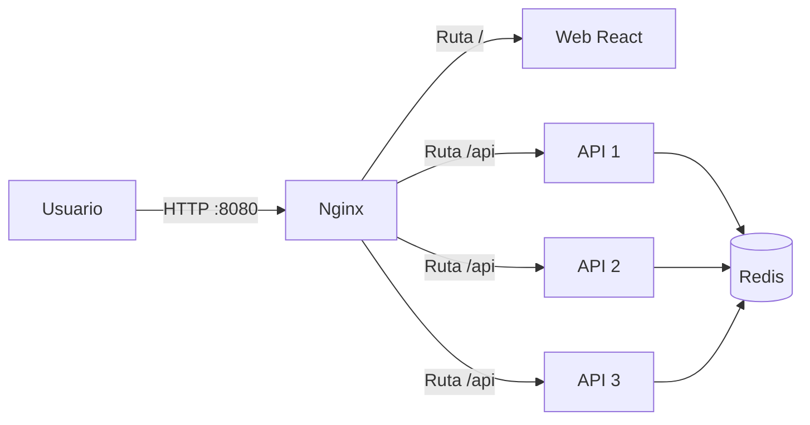
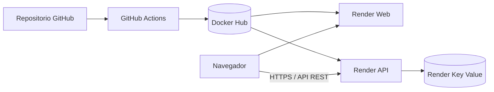

# Universidad Tecnológica Nacional

## Facultad Regional Resistencia

### DevOps — Trabajo Práctico N.º 1

# Fulbito5: aplicación web, API y Redis contenerizados

**Ciclo lectivo:** 2026  
**Docente:** José A. Fernández  

**Integrantes:**

- Moselli, Yamil Apas
- Ramírez, Eduardo Manuel
- Stegmayer, Tobias Sebastián

**Repositorio:** <https://github.com/yamilmoselli/tp1devops>  
**Fecha de entrega:** 14 de septiembre de 2026

---

## Índice

1. Introducción
2. Objetivos
3. Alcance funcional
4. Arquitectura de la solución
5. Tecnologías utilizadas
6. Implementación del frontend
7. Implementación de la API
8. Algoritmo de balanceo
9. Persistencia en Redis
10. Contenerización y orquestación
11. Proxy reverso, balanceo y tolerancia a fallos
12. Integración continua y seguridad
13. Publicación de imágenes y despliegue cloud
14. Pruebas y validaciones
15. Dificultades encontradas y soluciones aplicadas
16. Cumplimiento de la consigna
17. Resultados obtenidos
18. Mejoras futuras
19. Conclusiones
20. Anexo de comandos y evidencias

---

## 1. Introducción

El presente trabajo documenta el diseño, desarrollo, contenerización y despliegue de **Fulbito5**, una aplicación destinada a formar equipos equilibrados para partidos de fútbol 5.

La solución permite cargar diez jugadores, asignar a cada uno valores de ataque y defensa, calcular una división equilibrada en dos equipos de cinco integrantes y almacenar el resultado en Redis. Los partidos generados pueden ser consultados posteriormente desde la interfaz web.

El proyecto fue desarrollado con el propósito de aplicar de manera integrada los conceptos solicitados por la cátedra:

- Separación entre aplicación web, API y almacenamiento.
- Contenerización de servicios.
- Orquestación mediante Docker Compose.
- Uso de Redis como almacenamiento compartido.
- Implementación de un proxy reverso.
- Ejecución de múltiples réplicas de la API.
- Balanceo de carga y tolerancia a la caída de una instancia.
- Integración continua con pruebas automatizadas.
- Análisis estático de seguridad.
- Construcción y publicación automática de imágenes.
- Despliegue cloud desde un registro de contenedores.

En lugar de implementar el ejemplo básico de una lista de tareas, se seleccionó un dominio funcional que agrega valor mediante un algoritmo de optimización y permite demostrar con claridad el uso de un almacenamiento compartido entre diferentes réplicas.

---

## 2. Objetivos

### 2.1. Objetivo general

Diseñar e implementar una aplicación distribuida, contenerizada y desplegable que integre una interfaz web, una API REST y Redis, incorporando prácticas de integración continua, seguridad, publicación de artefactos y despliegue cloud.

### 2.2. Objetivos específicos

- Desarrollar una interfaz web para la carga y visualización de jugadores y partidos.
- Implementar una API REST como único punto de acceso a Redis.
- Validar los datos recibidos antes de procesarlos.
- Crear un algoritmo que minimice la diferencia entre dos equipos.
- Almacenar partidos y métricas en Redis.
- Ejecutar tres réplicas locales de la API a partir de una misma imagen.
- Distribuir solicitudes mediante Nginx.
- Verificar la continuidad del servicio ante la caída de una réplica.
- Automatizar pruebas unitarias y análisis de seguridad.
- Construir y publicar imágenes en Docker Hub mediante GitHub Actions.
- Desplegar la aplicación en Render utilizando las imágenes publicadas.

---

## 3. Alcance funcional

Fulbito5 implementa las siguientes funcionalidades:

- Carga de diez jugadores.
- Asignación de valores de ataque y defensa entre 1 y 5.
- Generación de datos de prueba desde la interfaz.
- Validación de nombres y cantidad de jugadores.
- Cálculo automático de dos equipos equilibrados.
- Visualización del resultado y del delta entre equipos.
- Persistencia de cada partido en Redis.
- Consulta del historial de partidos.
- Consulta del detalle de un partido seleccionado.
- Visualización de información de la réplica que atendió la solicitud.
- Registro del número acumulado de solicitudes.
- Visualización de hostname, dirección interna, uptime y cantidad de partidos.

La interfaz web no accede directamente a Redis. Toda operación de persistencia o consulta se realiza a través de la API, respetando la separación de responsabilidades solicitada.

### 3.1. Proceso de construcción del proyecto

El desarrollo se realizó de manera incremental. Cada fase incorporó una capacidad funcional o técnica y permitió validar la integración antes de avanzar al siguiente nivel.

#### Fase 1: definición de servicios y persistencia local

- Se implementó el backend con FastAPI y endpoints REST para crear, listar y consultar partidos, además de exponer información operativa de las réplicas.
- Se configuró Redis como almacén en memoria para registrar partidos, mantener un índice de identificadores y contabilizar visitas.
- Se desarrolló el frontend con React y Vite, manteniendo separadas la interfaz visual y la capa de acceso a datos.
- Se definieron imágenes independientes para la API y la web.
- Se incorporó Docker Compose para levantar Redis, tres réplicas de FastAPI, el frontend y Nginx.
- Se creó la red interna `backend`, utilizada para la comunicación entre contenedores.
- Se configuró un volumen con nombre para conservar los datos locales de Redis entre recreaciones de contenedores.

#### Fase 2: balanceo y tolerancia a fallos

- Se configuró Nginx como punto único de entrada en el puerto 8080.
- Se definió un upstream con `api1`, `api2` y `api3`.
- Se separó el enrutamiento de la web y de la API mediante las rutas `/` y `/api`.
- Se incorporó `REPLICA_ID` para identificar el nodo que procesa cada solicitud.
- Se verificó que, al detener una réplica, las restantes continuaran atendiendo solicitudes y utilizando los mismos datos almacenados en Redis.

#### Fase 3: integración continua y seguridad

- Se configuraron workflows de GitHub Actions para pushes y pull requests.
- Se automatizó la instalación de dependencias y la ejecución de pruebas unitarias con Pytest.
- Se incorporó Bandit para analizar patrones potencialmente inseguros en el código Python.
- Se incorporó Trivy para auditar Dockerfiles y la configuración de Docker Compose.
- Se configuró la publicación de resultados SARIF en GitHub Code Scanning.
- Se agregaron badges al README para visualizar el estado de CI y SAST.

#### Fase 4: publicación y despliegue cloud

- Se configuró Docker Buildx mediante `docker/setup-buildx-action`.
- Se automatizó la construcción de las imágenes de API y web.
- Se publicaron las imágenes en Docker Hub bajo los repositorios `yamilmoselli/fulbito5-api` y `yamilmoselli/fulbito5-web`.
- Cada imagen se etiqueta como `latest` y también con el SHA del commit que la produjo.
- Se creó un servicio Key Value en Render para la persistencia.
- Se desplegó la API desde la imagen existente en Docker Hub.
- Se desplegó el frontend como servicio web basado en una imagen Nginx.
- Se configuró la dirección pública de la API durante la compilación de Vite.

---

## 4. Arquitectura de la solución

### 4.1. Arquitectura local



La arquitectura local está compuesta por seis contenedores:

1. Un contenedor Redis.
2. Tres contenedores de la API.
3. Un contenedor para la aplicación web.
4. Un contenedor Nginx que funciona como entrada al sistema.

Todos los servicios se conectan a la red privada `backend`. El único puerto publicado para el acceso del usuario es el 8080 del proxy reverso.

Nginx aplica las siguientes reglas:

- Las solicitudes con prefijo `/api` se distribuyen entre las tres réplicas FastAPI.
- Las solicitudes restantes se envían al servicio web.

Las réplicas comparten el mismo Redis. Por esta razón, la información no depende de la instancia particular que atiende cada solicitud.

### 4.2. Arquitectura cloud



En el entorno cloud se utilizan servicios independientes para la web, la API y Redis. La comunicación del navegador con la API utiliza su URL pública, incorporada al frontend mediante la variable de compilación `VITE_API_URL`.

La consigna establece como obligatoria la arquitectura completa con proxy y réplicas en local, mientras que para el entorno cloud exige al menos una instancia funcional publicada desde un registro. Por ese motivo, el balanceo de tres nodos se demuestra en Docker Compose y Render ejecuta una instancia de cada aplicación.

---

## 5. Tecnologías utilizadas

| Área | Tecnología | Función |
|---|---|---|
| Frontend | React 18 | Construcción de la interfaz |
| Frontend | Vite 5 | Desarrollo y compilación del frontend |
| Frontend | Nginx Unprivileged | Servidor de archivos estáticos |
| Backend | Python 3.11 | Lenguaje de la API |
| Backend | FastAPI | Framework de API REST |
| Backend | Uvicorn | Servidor ASGI |
| Validación | Pydantic | Validación de modelos de entrada |
| Persistencia | Redis 7 | Almacenamiento en memoria |
| Proxy | Nginx | Enrutamiento y balanceo de carga |
| Contenedores | Docker | Construcción y ejecución de imágenes |
| Orquestación | Docker Compose | Definición del entorno local |
| Pruebas | Pytest | Pruebas automatizadas |
| Seguridad | Bandit | SAST para código Python |
| Seguridad | Trivy | Análisis de configuración y contenedores |
| Automatización | GitHub Actions | CI, SAST y CD |
| Registro | Docker Hub | Almacenamiento de imágenes |
| Cloud | Render | Ejecución de los servicios publicados |

---

## 6. Implementación del frontend

La aplicación web se divide en componentes con responsabilidades específicas:

### `App.jsx`

Es el componente principal. Mantiene el último partido guardado o seleccionado y coordina la actualización del historial.

### `PlayerForm.jsx`

Permite:

- Cargar nombres.
- Asignar ataque y defensa.
- Completar valores aleatorios de prueba.
- Enviar los diez jugadores a la API.
- Mostrar los equipos obtenidos.
- Informar errores de validación o comunicación.

### `MatchExplorer.jsx`

Consulta el listado almacenado en Redis y permite recuperar el detalle de un partido mediante su identificador.

### `NodeBanner.jsx`

Muestra información operativa de la API:

- Réplica o hostname.
- IP interna.
- Tiempo de actividad.
- Número de partidos.
- Cantidad acumulada de solicitudes.

También permite emitir varias solicitudes consecutivas para observar el balanceo entre nodos.

### Configuración de la URL de API

La URL se centraliza en `web/src/api.js`. El helper utiliza `import.meta.env.VITE_API_URL` cuando la aplicación se compila para Render. Cuando la variable no está definida, conserva las rutas relativas utilizadas por el proxy local.

```text
Entorno local:
/api/partidos

Entorno cloud:
https://fulbito5-api-latest.onrender.com/api/partidos
```

Esta estrategia permite utilizar el mismo código fuente en ambas arquitecturas sin repetir direcciones en cada componente.

---

## 7. Implementación de la API

La API fue desarrollada con FastAPI y expone operaciones REST para telemetría y administración de partidos.

### 7.1. Variables de entorno

| Variable | Descripción | Valor local |
|---|---|---|
| `REPLICA_ID` | Identificador visible de la réplica | 1, 2 o 3 |
| `REDIS_HOST` | Dirección del servicio Redis | `redis` |
| `REDIS_PORT` | Puerto de Redis | `6379` |

La configuración mediante variables evita incorporar en el código direcciones específicas del entorno de ejecución.

### 7.2. Validación

El modelo `JugadorIn` exige:

- Nombre en formato texto.
- Ataque entre 1 y 5.
- Defensa entre 1 y 5.

La creación de un partido requiere exactamente diez jugadores. Una cantidad diferente genera una respuesta HTTP 400.

### 7.3. Endpoints

| Método | Ruta | Descripción |
|---|---|---|
| GET | `/api` | Identifica la réplica |
| GET | `/api/visitas` | Devuelve el contador de solicitudes |
| GET | `/api/health` | Informa el estado básico de la API |
| GET | `/api/info` | Devuelve telemetría del nodo |
| POST | `/api/partidos` | Crea, balancea y almacena un partido |
| GET | `/api/partidos` | Lista los partidos almacenados |
| GET | `/api/partidos/{id}` | Recupera un partido específico |

### 7.4. Réplicas stateless

El código ejecutado por `api1`, `api2` y `api3` es idéntico. La diferencia se establece mediante `REPLICA_ID`.

Ninguna réplica mantiene el historial en memoria propia. Los datos compartidos se almacenan en Redis, lo que permite:

- Distribuir solicitudes entre instancias.
- Reemplazar una réplica sin migrar datos.
- Detener una instancia y continuar utilizando las restantes.

---

## 8. Algoritmo de balanceo

El objetivo consiste en dividir diez jugadores en dos grupos de cinco minimizando la diferencia de capacidad total.

Para cada jugador se calcula:

```text
puntaje = ataque + defensa
```

Luego se evalúan todas las combinaciones posibles de cinco jugadores:

```text
C(10,5) = 252
```

Para cada combinación se determina el equipo complementario y se calcula:

```text
delta = valor absoluto(puntaje_equipo_A - puntaje_equipo_B)
```

La solución conserva la combinación con el menor delta encontrado.

Debido a que la entrada siempre contiene diez jugadores, el número de combinaciones es fijo y reducido. La búsqueda exhaustiva resulta adecuada porque garantiza encontrar una solución óptima sin introducir complejidad innecesaria.

El resultado contiene:

- Equipo A.
- Equipo B.
- Delta mínimo.

---

## 9. Persistencia en Redis

Redis es el almacenamiento común de las réplicas. Se utilizan las siguientes estructuras:

| Patrón de clave | Tipo Redis | Uso |
|---|---|---|
| `api:visitas` | String numérico | Contador global de solicitudes |
| `partido:<uuid>` | Hash | Información completa de un partido |
| `partidos:indice` | Set | Índice de identificadores de partidos |

### 9.1. Registro de visitas

Un middleware incrementa `api:visitas` por cada solicitud recibida. Como el contador está en Redis, todas las réplicas contribuyen al mismo valor.

### 9.2. Registro de partidos

Para cada partido se genera:

- Un UUID.
- Una fecha y hora UTC.
- Los dos equipos serializados como JSON.
- El delta calculado.

La información se guarda en un hash `partido:<uuid>`. El UUID se incorpora además a `partidos:indice`.

### 9.3. Consulta

Para listar partidos, la API recupera los identificadores del set, consulta cada hash, deserializa los equipos y ordena el resultado por fecha descendente.

La utilización de un índice explícito evita depender de un escaneo general de claves para la operación normal.

---

## 10. Contenerización y orquestación

### 10.1. Imagen de la API

La imagen utiliza `python:3.11-slim` y realiza los siguientes pasos:

1. Define `/app` como directorio de trabajo.
2. Copia e instala las dependencias.
3. Copia el código fuente.
4. Crea un usuario no privilegiado.
5. Expone el puerto 8000.
6. Ejecuta Uvicorn en `0.0.0.0:8000`.

El uso de una imagen slim reduce el tamaño base. La ejecución mediante `appuser` evita utilizar root durante la operación normal.

### 10.2. Imagen del frontend

Se utiliza una construcción multi-stage:

1. Una etapa basada en Node 20 instala dependencias y compila React.
2. Una etapa final basada en Nginx Unprivileged recibe únicamente los archivos estáticos.

La etapa final no contiene Node ni herramientas de compilación. Esto reduce el tamaño y la superficie de ataque del contenedor productivo.

La web escucha en el puerto 8080 porque el proceso Nginx se ejecuta sin privilegios.

### 10.3. Docker Compose

El archivo `docker-compose.yml` define:

- Red privada `backend`.
- Volumen `redis-data`.
- Redis basado en `redis:7-alpine`.
- Tres instancias de FastAPI.
- Servicio web.
- Proxy Nginx.

`api1` construye la imagen `fastapi-replica:1.0.0`, mientras que `api2` y `api3` reutilizan el mismo artefacto. De este modo se demuestra que las réplicas no requieren imágenes diferentes.

---

## 11. Proxy reverso, balanceo y tolerancia a fallos

Nginx define las tres APIs dentro de un upstream:

```nginx
upstream backend {
    server api1:8000;
    server api2:8000;
    server api3:8000;
}
```

Sin una directiva adicional, Nginx utiliza round-robin. Las solicitudes se distribuyen sucesivamente entre los nodos disponibles.

La configuración separa dos ubicaciones:

```text
/api  → upstream backend
/     → web:8080
```

También se transmiten los encabezados `Host`, `X-Real-IP` y `X-Forwarded-For`, necesarios para conservar información sobre la solicitud original.

### Demostración de balanceo

Las solicitudes repetidas a `/api` devuelven el valor de `REPLICA_ID`. Una secuencia permite observar respuestas de los nodos 1, 2 y 3.

### Demostración de tolerancia

Al detener `api2`, Nginx continúa enviando solicitudes a las instancias restantes. Los datos continúan disponibles porque se encuentran en Redis y no dentro del contenedor detenido.

---

## 12. Integración continua y seguridad

### 12.1. Workflow de CI

El workflow `ci.yml` se activa con:

- Push a `main`.
- Push a `develop`.
- Pull request hacia `main`.

Sus tareas principales son:

1. Obtener el código.
2. Configurar Python 3.11.
3. Instalar dependencias.
4. Ejecutar pruebas con Pytest.
5. Analizar Python con Bandit.
6. Analizar configuración con Trivy.

El badge correspondiente se encuentra en el README del repositorio.

### 12.2. Workflow de SAST

El workflow `sast.yml` realiza un análisis de seguridad independiente:

- Bandit inspecciona el código Python.
- Trivy busca problemas HIGH y CRITICAL en la configuración.
- Los resultados de Trivy se generan en formato SARIF.
- GitHub Code Scanning recibe y presenta los resultados.

Separar este workflow permite visualizar claramente el estado del análisis de seguridad mediante un segundo badge.

### 12.3. Medidas aplicadas

- Ejecución de los contenedores como usuarios no root.
- Uso de secrets para Docker Hub.
- Validación de entradas con Pydantic.
- Automatización de pruebas antes de publicar cambios.
- Bloqueo del análisis ante hallazgos de severidad alta o crítica.
- Fijación de la acción Trivy mediante un SHA específico.

---

## 13. Publicación de imágenes y despliegue cloud

### 13.1. Publicación en Docker Hub

El workflow `cd.yml` se ejecuta al realizar un push a `main`.

Construye y publica:

```text
<usuario>/fulbito5-api:latest
<usuario>/fulbito5-api:<sha>
<usuario>/fulbito5-web:latest
<usuario>/fulbito5-web:<sha>
```

La etiqueta `latest` identifica la última versión publicada. El tag basado en SHA permite relacionar una imagen con un commit concreto y facilita auditoría o rollback.

Las credenciales se almacenan en:

- `DOCKERHUB_USERNAME`.
- `DOCKERHUB_TOKEN`.

Estos valores se gestionan como GitHub Secrets y no forman parte del código.

### 13.2. Configuración del frontend cloud

Durante la construcción de la web, GitHub Actions proporciona:

```text
VITE_API_URL=https://fulbito5-api-latest.onrender.com
```

Vite incorpora el valor al bundle estático. Esta configuración es necesaria porque los servicios web y API poseen dominios diferentes en Render.

### 13.3. Servicios cloud

Los servicios se crean en Render utilizando imágenes existentes del registro:

- API: `https://fulbito5-api-latest.onrender.com`
- Web: `https://fulbito5-web-latest.onrender.com`
- Redis: servicio Render Key Value compatible con Redis.

La API recibe `REDIS_HOST` y `REDIS_PORT` como variables de entorno.

### 13.4. Actualización del despliegue

Una vez publicada una imagen nueva, el servicio basado en imagen debe volver a desplegar la referencia más reciente. El procedimiento utilizado es:

1. Integrar cambios a `main`.
2. Esperar la finalización del workflow de CD.
3. Confirmar la imagen nueva en Docker Hub.
4. Seleccionar **Deploy latest reference** en Render.
5. Verificar los endpoints y la web.

---

## 14. Pruebas y validaciones

### 14.1. Pruebas del algoritmo

Las pruebas automatizadas verifican que:

- Se produzcan dos equipos de cinco integrantes.
- No se repitan jugadores entre equipos.
- Todos los jugadores de entrada estén en el resultado.
- El delta sea el menor posible.
- Se rechace una entrada con una cantidad distinta de diez jugadores.

Para validar la optimalidad, la prueba calcula por fuerza bruta el mejor delta y lo compara con la salida de la función.

### 14.2. Prueba de API

Se valida que el endpoint principal responda correctamente e incluya la identificación de la réplica.

### 14.3. Validaciones de integración

En el entorno completo se comprueban:

- Comunicación navegador → Nginx.
- Enrutamiento Nginx → web.
- Enrutamiento Nginx → API.
- Comunicación API → Redis.
- Persistencia del historial.
- Distribución entre tres réplicas.
- Continuidad al detener una instancia.

---

## 15. Dificultades encontradas y soluciones aplicadas

### Resumen de inconvenientes

| Inconveniente | Impacto | Solución aplicada | Aprendizaje obtenido |
|---|---|---|---|
| Contenedores ejecutados como root | Hallazgos HIGH de Trivy y mayor riesgo | Usuarios no privilegiados y Nginx Unprivileged | La seguridad debe considerarse desde el diseño de la imagen |
| Cambio de Nginx al modo no privilegiado | Imposibilidad de utilizar el puerto 80 dentro de la web | Migración a 8080 y actualización del proxy | Puertos, Dockerfile y proxy deben mantenerse alineados |
| Configuración y versión de Trivy | Fallos o resultados inconsistentes en SAST | Corrección de parámetros y fijación mediante SHA | Las herramientas del pipeline también requieren control de versiones |
| Responsabilidades duplicadas en Actions | Pipeline difícil de mantener y comprender | Separación entre CI, SAST y CD | Cada workflow debe tener un objetivo concreto |
| Rutas relativas en Render | El Nginx web devolvía 404 para `/api/...` | Helper central y `VITE_API_URL` | La topología del entorno modifica la forma de resolver endpoints |
| Imagen nueva no reflejada en Render | Persistencia del frontend anterior | Redeploy de la referencia más reciente | Publicar una imagen y desplegarla son operaciones distintas |

Los inconvenientes no se consideraron únicamente errores aislados. Cada uno permitió revisar una decisión de arquitectura, seguridad o automatización y producir una mejora verificable en el proyecto.

### 15.1. Ejecución de contenedores como root

Trivy detectó que los contenedores se ejecutaban con privilegios de root y reportó hallazgos de severidad alta.

La solución consistió en:

- Crear y utilizar `appuser` en la API.
- Adoptar `nginxinc/nginx-unprivileged` para la web.
- Adaptar el puerto del frontend de 80 a 8080.
- Actualizar el proxy para dirigir el tráfico al nuevo puerto.

Esta incidencia demostró que una medida de seguridad puede requerir cambios coordinados en múltiples servicios.

### 15.2. Configuración de Trivy

Durante la implementación del análisis se encontraron incompatibilidades de formato y versión en `trivy-action`.

Se corrigieron los parámetros y se fijó una versión mediante el SHA del commit de la acción. Esto mejoró la reproducibilidad del workflow.

### 15.3. Separación entre CI y CD

En una etapa inicial, la construcción y publicación de imágenes estaba mezclada con tareas de CI.

Se reorganizaron los workflows:

- `ci.yml` se encarga de validación y pruebas.
- `sast.yml` presenta el análisis de seguridad.
- `cd.yml` construye y publica imágenes.

La separación simplifica el diagnóstico y permite asignar responsabilidades claras.

### 15.4. Enrutamiento diferente entre local y cloud

En local, las llamadas relativas `/api/...` funcionan porque el proxy frontal las dirige a FastAPI. En Render, el frontend y la API son servicios separados.

El error observado fue:

```text
open() "/usr/share/nginx/html/api/partidos" failed
GET /api/partidos HTTP/1.1 404
```

Nginx intentaba encontrar `/api/partidos` como un archivo estático dentro del contenedor web.

La solución consistió en centralizar las URLs del frontend y utilizar `VITE_API_URL` para el entorno cloud, manteniendo rutas relativas en local.

### 15.5. Diferencia entre publicar y desplegar

Actualizar la etiqueta `latest` en Docker Hub no reemplaza por sí mismo un contenedor que ya se encuentra ejecutándose en Render.

Se incorporó al procedimiento la actualización explícita mediante **Deploy latest reference**. De este modo se diferencia claramente:

- La publicación del artefacto en el registry.
- La creación de una nueva instancia a partir de ese artefacto.

### 15.6. Inyección de variables durante la compilación de Vite

Al desplegar el frontend en Render, las solicitudes `GET /api/info`, `GET /api/partidos` y `POST /api/partidos` devolvían HTTP 404.

El log de Nginx mostraba:

```text
open() "/usr/share/nginx/html/api/partidos" failed
```

Este mensaje indicaba que la solicitud había llegado al servidor web y que Nginx estaba intentando encontrar `/api/partidos` dentro del directorio de archivos estáticos.

Vite genera un bundle estático y sustituye las variables `import.meta.env.*` durante `npm run build`. Una variable agregada solamente al entorno de ejecución del contenedor Nginx no modifica un bundle que ya fue compilado.

Para resolverlo se incorporó en `web/Dockerfile`:

```dockerfile
ARG VITE_API_URL
ENV VITE_API_URL=$VITE_API_URL
```

Además, el workflow `cd.yml` entrega el valor durante la construcción:

```yaml
build-args: |
  VITE_API_URL=https://fulbito5-api-latest.onrender.com
```

De esta manera, la dirección del backend se encuentra disponible cuando Vite genera los archivos de producción.

### 15.7. Rutas hardcodeadas en los componentes React

La incorporación del argumento de build no resolvió por sí sola el problema. Los componentes `PlayerForm.jsx`, `NodeBanner.jsx` y `MatchExplorer.jsx` seguían utilizando rutas relativas escritas directamente en cada llamada `fetch()`.

Ejemplo anterior:

```javascript
fetch("/api/partidos")
```

Como los componentes no consultaban `VITE_API_URL`, el navegador continuaba enviando solicitudes al dominio del frontend.

La solución consistió en crear `web/src/api.js`, que normaliza la URL base y construye todos los endpoints. Los componentes fueron modificados para utilizar esta función común.

La implementación conserva dos comportamientos:

- En Render utiliza la URL pública de FastAPI.
- En Docker Compose utiliza rutas relativas, que son interceptadas por el proxy Nginx local.

La centralización evita duplicación y permite modificar la ubicación de la API sin editar cada componente.

### 15.8. Política de mismo origen y CORS

La separación de frontend y API en subdominios diferentes convierte las solicitudes en operaciones cross-origin. Los navegadores exigen que la API responda con encabezados CORS adecuados.

FastAPI fue configurado con `CORSMiddleware`, permitiendo orígenes, métodos y encabezados necesarios para la comunicación:

```python
app.add_middleware(
    CORSMiddleware,
    allow_origins=["*"],
    allow_methods=["*"],
    allow_headers=["*"],
)
```

Esta configuración facilita la etapa académica y evita que el navegador bloquee las llamadas entre ambos servicios. Como mejora de producción se propone reemplazar `"*"` por el dominio específico del frontend.

Es importante diferenciar este aspecto del error 404 original: el 404 se producía antes de llegar a la API, dentro del Nginx del frontend. CORS se vuelve relevante una vez que la solicitud se dirige correctamente al dominio de FastAPI.

### 15.9. Conectividad con Redis administrado

En Docker Compose, la API accede a Redis mediante el hostname `redis`, resuelto por el DNS interno de la red `backend`. Ese nombre no es válido automáticamente en Render.

Para evitar una dependencia rígida del entorno, `main.py` obtiene la configuración desde:

```text
REDIS_HOST
REDIS_PORT
```

En Render se utilizan el hostname y el puerto internos suministrados por el servicio Key Value. Esto permite que la misma imagen funcione localmente y en cloud sin modificar el código fuente.

### 15.10. Severidad y estabilidad del pipeline de seguridad

Durante la configuración inicial se produjeron fallos relacionados con el formato y la versión de la acción Trivy. También se detectaron hallazgos reales por la ejecución de contenedores como root.

Las medidas aplicadas fueron:

- Corregir el formato de configuración de `trivy-action`.
- Actualizar y fijar la acción de Trivy mediante un SHA.
- Limitar el criterio de bloqueo a severidades HIGH y CRITICAL.
- Mantener `exit-code: "1"` para que un hallazgo grave detenga efectivamente el workflow.
- Corregir las causas detectadas, especialmente la ejecución como root, en lugar de ignorarlas.

No se utiliza `continue-on-error: true` para ocultar fallos. Los resultados se generan en formato SARIF y se suben incluso cuando el escaneo encuentra problemas, mediante `if: always()` en el paso de publicación.

### 15.11. Pruebas locales y dependencia de Redis

Las pruebas del algoritmo son unitarias y no requieren Redis. Sin embargo, las pruebas que utilizan `TestClient` ejecutan el middleware de visitas, que intenta acceder al almacenamiento.

Fuera de Docker Compose, el hostname `redis` puede no resolverse o la conexión puede demorar. Esto no representa un error del algoritmo, sino una dependencia externa presente durante una prueba de endpoint.

Como mejora se propone reemplazar el cliente Redis por un mock o una fixture durante pruebas unitarias y reservar las conexiones reales para una suite de integración separada.

---

## 16. Cumplimiento de la consigna

| Consigna | Evidencia |
|---|---|
| Web y API contenerizadas | `web/Dockerfile` y `app/Dockerfile` |
| API conectada a Redis | Cliente Redis configurado mediante variables |
| Publicación mediante Actions | `.github/workflows/cd.yml` |
| Deploy cloud desde registry | Servicios Render basados en imágenes Docker Hub |
| Tests unitarios | `app/test_main.py` y `app/test_balanceo.py` |
| SAST | Bandit, Trivy y carga SARIF |
| Badges | Badges CI y SAST en README |
| Proxy reverso | `nginx/nginx.conf` |
| Tres nodos | `api1`, `api2` y `api3` en Compose |
| Balanceo | Upstream Nginx y endpoint de identificación |
| Tolerancia a caída | Continuidad con una réplica detenida |
| Visualización en Redis | Contador, hashes e índice consultables con redis-cli |
| Informe | Presente documento |

---

## 17. Resultados obtenidos

La implementación permitió obtener los siguientes resultados:

- Aplicación funcional para generar equipos equilibrados.
- Separación efectiva entre presentación, lógica y persistencia.
- Comunicación entre servicios mediante una red Docker privada.
- Persistencia compartida entre múltiples réplicas.
- Balanceo observable mediante identificadores de nodo.
- Continuidad de consultas al retirar una instancia.
- Imágenes de producción sin ejecución como root.
- Pruebas automatizadas del comportamiento principal.
- Análisis de seguridad integrado al repositorio.
- Construcción y publicación automática de imágenes.
- Identificación de imágenes mediante tags inmutables basados en SHA.
- Despliegue de servicios desde Docker Hub hacia Render.
- Resolución de diferencias de configuración entre los entornos local y cloud.

---

## 18. Mejoras futuras

### Priorización propuesta

| Prioridad | Mejora | Beneficio esperado |
|---:|---|---|
| Alta | Unificar el health check de API, Docker y Render | Evitar falsos estados unhealthy y despliegues fallidos |
| Alta | Automatizar Render mediante deploy hooks | Reducir tareas manuales y riesgo de ejecutar una imagen anterior |
| Alta | Incorporar mocks y timeouts para Redis | Pruebas más rápidas y mejor comportamiento ante fallos |
| Media | Desplegar tags SHA o digests | Mayor trazabilidad y rollback reproducible |
| Media | Agregar pruebas del frontend | Detectar errores de configuración de URLs antes del deploy |
| Media | Restringir CORS | Reducir exposición innecesaria de la API |
| Media | Incorporar lockfiles | Obtener instalaciones y builds reproducibles |
| Baja | Métricas y logs estructurados | Mejorar observabilidad y diagnóstico operativo |
| Baja | Nuevas funciones de usuarios y estadísticas | Ampliar el valor funcional del producto |

Las prioridades altas se relacionan directamente con confiabilidad del despliegue. Las prioridades medias fortalecen calidad, seguridad y trazabilidad. Las de prioridad baja agregan observabilidad o amplían el alcance del producto sin bloquear el cumplimiento actual.

### 18.1. Automatización

- Configurar deploy hooks para actualizar Render al finalizar CD.
- Definir la infraestructura mediante `render.yaml`.
- Desplegar mediante tags SHA o digests en lugar de depender de `latest`.

### 18.2. Pruebas

- Incorporar pruebas automatizadas del frontend.
- Simular Redis mediante mocks en pruebas unitarias.
- Agregar pruebas de integración con Redis real.
- Validar automáticamente la construcción de ambas imágenes.

### 18.3. Seguridad

- Restringir CORS al dominio productivo.
- Fijar por SHA todas las acciones externas.
- Incorporar lockfiles para builds reproducibles.
- Escanear las imágenes resultantes además de la configuración.

### 18.4. Operación

- Unificar la ruta de health check entre aplicación, Docker y Render.
- Agregar timeouts explícitos y reintentos controlados para Redis.
- Implementar readiness verificando la conexión al almacenamiento.
- Incorporar métricas, alertas y logs estructurados.

### 18.5. Funcionalidad

- Agregar usuarios y autenticación.
- Permitir editar y eliminar partidos.
- Incorporar posiciones y restricciones adicionales.
- Registrar resultados reales y estadísticas históricas.

---

## 19. Conclusiones

Fulbito5 permitió integrar en un único proyecto los principales conceptos abordados por el trabajo práctico. La solución combina desarrollo de software, contenerización, redes, persistencia, automatización y despliegue.

La utilización de tres réplicas stateless y Redis como almacenamiento común demuestra una arquitectura escalable a pequeña escala. Nginx permite distribuir solicitudes y conservar disponibilidad cuando una instancia es retirada. Docker Compose hace reproducible el entorno local y facilita la demostración de todos los componentes.

GitHub Actions agrega controles automáticos de calidad y seguridad, mientras que Docker Hub actúa como fuente de artefactos para Render. La publicación simultánea con etiquetas `latest` y SHA brinda comodidad y trazabilidad.

Las dificultades encontradas fueron parte relevante del aprendizaje. Los hallazgos de Trivy condujeron a ejecutar los contenedores sin privilegios; la separación de workflows mejoró el pipeline; y el error de rutas en Render permitió comprender la diferencia entre una arquitectura local con proxy único y un despliegue cloud con dominios independientes.

En conclusión, el proyecto cumple los requerimientos funcionales y técnicos planteados, añade una problemática propia y deja identificadas mejoras concretas para incrementar automatización, seguridad, observabilidad y cobertura de pruebas.

---

## 20. Anexo de comandos y evidencias

### 20.1. Inicio del entorno

```powershell
docker compose up --build -d
docker compose ps
```

URL local:

```text
http://localhost:8080/
```

### 20.2. Verificación del balanceo

```powershell
1..9 | ForEach-Object {
    Invoke-RestMethod http://localhost:8080/api
}
```

### 20.3. Consulta de Redis

```powershell
docker compose exec redis redis-cli GET api:visitas
docker compose exec redis redis-cli SMEMBERS partidos:indice
docker compose exec redis redis-cli KEYS "partido:*"
```

Para inspeccionar un partido particular:

```powershell
docker compose exec redis redis-cli HGETALL "partido:<uuid>"
```

### 20.4. Tolerancia a fallos

```powershell
docker compose stop api2

1..6 | ForEach-Object {
    Invoke-RestMethod http://localhost:8080/api
}

docker compose start api2
```

### 20.5. Pruebas

```powershell
python -m venv .venv
.\.venv\Scripts\Activate.ps1
pip install -r app\requirements.txt
python -m pytest app
```

### 20.6. Logs

```powershell
docker compose logs -f nginx
docker compose logs -f api1
docker compose logs -f redis
```

### 20.7. Detención del entorno

```powershell
docker compose down
```

### 20.8. Evidencias recomendadas para adjuntar

1. Captura de la aplicación con los equipos generados.
2. Captura del historial recuperado desde Redis.
3. Salida de `redis-cli` mostrando claves y hashes.
4. Respuestas alternadas de las tres réplicas.
5. Continuidad luego de detener una réplica.
6. Badges de CI y SAST.
7. Ejecución exitosa de GitHub Actions.
8. Imágenes y tags en Docker Hub.
9. Servicios web y API en Render.
10. Peticiones exitosas observadas en las herramientas del navegador.
